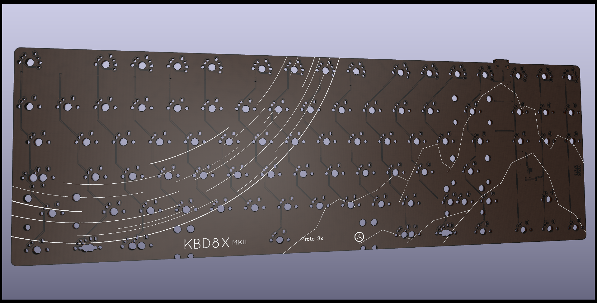
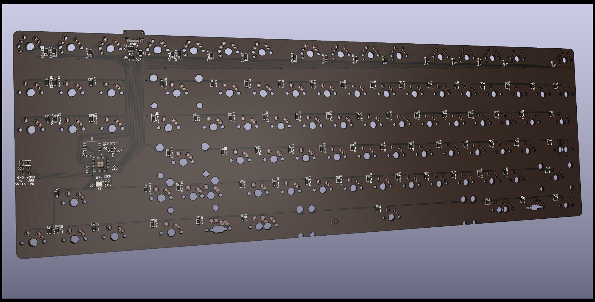
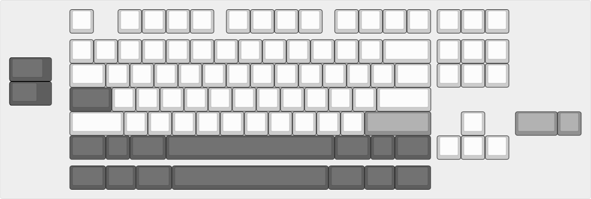

## Custom pcb for kbd8x-mkii based on my own personal preference

### Simplified version, less layout, less feature, more clean 

Any recommendations will be ignored and you will be banned, unless you point out fatal flaws in the pcb in which case you can stay

Insta ban if you mention iso support. I may or may not regret this when I find an iso alps board with good condition keycaps

Board dimension, layout and part of the schematics are based on [ai03's kbd8x-mkii's repo](https://github.com/ai03-2725/KBD8X-MKII-PCB), rp2040 routing and schematics are based on [sleepdealer's rpad](https://github.com/Sleepdealr/RPAD)

Todo list:
- ~~Swap out mcu for a different one like rp2040~~ (good luck finding at32u4 for cheap nowadays)
- Add jst connector for shits and giggles (if i can use it for something funny i can yeet out the brass weight and use it)
- ~~Possible alps support? if i can't get blue, amber or brown alps i can go for matias switches~~
- More meme cuts (maybe or maybe not)
- Make pcb thinner, 1.2mm? thinner pcb = easier to millmax / rivet
- ~~jis-alike layout~~: tried, not a good idea
- ~~aek layout~~: aek and 7u layout will be south facing, ~~standard 6.25u layout will be north facing~~ dropped standard layout
- ~~F1-8k layout: REMOVED, check **complex** version of the pcb~~

Layout supports:

