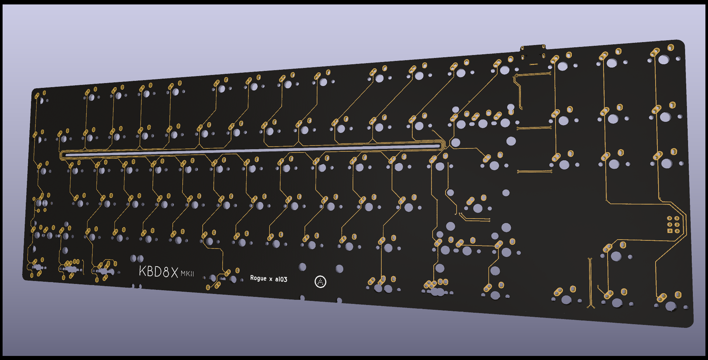

### Custom pcb for kbd8x-mkii based on my own personal preference (i.e. stripped down, alps support and more layouts)

Any recommendations will be ignored and you will be banned, unless you point out fatal flaws in the pcb in which case you can stay

PCB keeps the same matrix as ai03's original matrix as much as possible

Insta ban if you mention iso support (if i decide to do it, it's gonna be for the BIGASS enter, will consider yeeting out the split left shift in the future)

Based on [ai03's kbd8x-mkii's public repo pcb kicad file](https://github.com/ai03-2725/KBD8X-MKII-PCB/blob/master/KBD8X-MK2.kicad_pcb)

Todo list:
- Swap out mcu for a different one (good luck finding at32u4 for cheap)
- Add jst connector for shits and giggles (if i can use it for something funny i can yeet out the brass weight and use it)
- ~~Possible alps support? if i can't get blue,amber or brown alps i can go for matias switches~~
- More meme cuts (maybe or maybe not)
- Make pcb thinner, 1.2mm? thinner pcb = better pcb rivet hotswap socket support
- jis-like layout (but not really jis, either 4.5u layout or minila 3u layout)
- ~~aek layout~~ ~~some aek or alps only layout will only be using alps only sockets (1.5u stepped caps lock, aek 6.5u bottom row). mx only layout will use mx only sockets (1.25u stepped caps lock, standard bottom row)~~ (AEK LAYOUT CANNOT WORK WITH 6.25u LAYOUT)

Now split into 2 PCBs, one with standard 6.25u and tsangan 7u layout support, one with tsangan 7u and aek 6.5u supoprt

Potential supported layouts (either 6.25u or aek only, not both):

